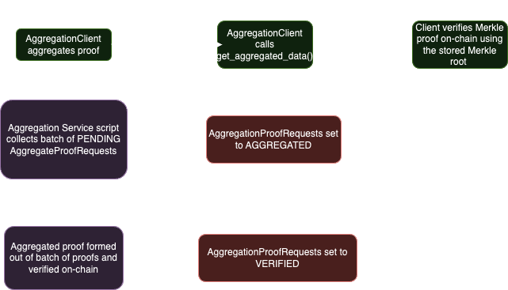

# SP1 Proof Aggregation Service

Provides a service for aggregating [SP1](https://github.com/succinctlabs/sp1) proofs from multiple users. 



## Requirements

- [Rust](https://rustup.rs/)
- [SP1](https://docs.succinct.xyz/getting-started/install.html)

## Running the Service

There are four steps to running the service:

1. **Run the Aggregation Server**
   ```sh
   cd rpc
   cargo run
   ```
   Should output something like:
   ```
   RPC server started on 127.0.0.1:50051
   ```
   Update the `RPC_GRPC_ADDR` variable in the `.env` file with the address displayed in the output.

2. **Run the Aggregation Service**
   ```sh
   cd script
   RUST_LOG=info cargo run --release -- --prove
   ```

3. **Run the Aggregation Client SDK to test the aggregation service**
   ```sh
   cargo run --release --bin aggregation_client_sdk
   ```

## User API

To be able to aggregate your SP1 proofs, 
you need to use the `sp1-sdk` to interact with the aggregation service. Here's an example of how to use it:

```rust
use sp1_sdk::AggregationClient;

#[tokio::main]
async fn main() -> Result<(), Box<dyn std::error::Error>> {
    let client = ProverClient::new();
    let aggregation_client = AggregationClient::new();
    let (pk, vk) = client.setup(PROGRAM_ELF);
    let mut stdin = SP1Stdin::new();
    let proof = client
		.prove(&pk, stdin)
		.compressed()
		.run()
		.expect("proving failed");
    let proof_id = aggregation_client.aggregate(proof, vk).await?;

     let aggregated_data_response = aggregation_client
        .get_aggregated_data(proof_id)
        .await
        .unwrap();

    let result = aggregation_client.verify_aggregated_data(proof_id, aggregated_data_response).await.expect("verification failed");

    Ok(())
}
```
**Note:** Make sure to set `AGGREGATION_RPC_ADDR` in the `.env` file to the address of the aggregation server.
